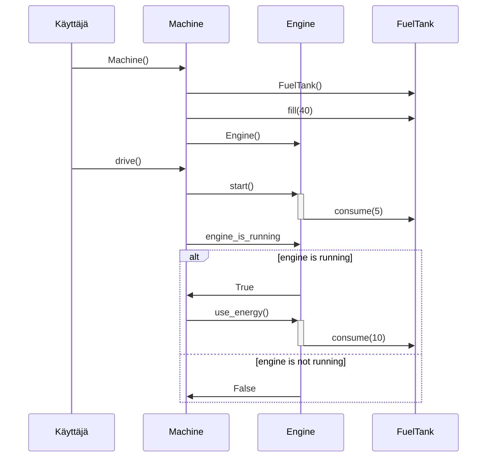

```mermaid
sequenceDiagram
participant K as Käyttäjä
participant M as Machine
participant E as Engine
participant F as FuelTank

K->>M:Machine()
M->>F:FuelTank()
M->>F:fill(40)
M->>E:Engine()

K->>M:drive()
M->>+E:start()
E->>-F:consume(5)
M->>E:engine_is_running
alt engine is running
E->>M:True
M->>+E:use_energy()
E->>-F:consume(10)
else engine is not running
E->>M:False
end


```
