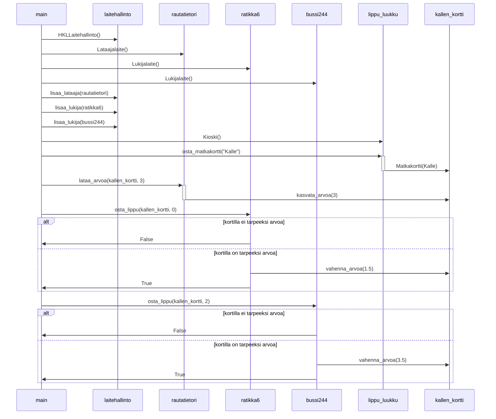

```mermaid
sequenceDiagram
participant M as main
participant L as laitehallinto
participant T as rautatietori
participant R as ratikka6
participant B as bussi244
participant LL as lippu_luukku
participant K as kallen_kortti


M->>L:HKLLaitehallinto()
M->>T:Lataajalaite()
M->>R:Lukijalaite()
M->>B:Lukijalaite()

M->>L:lisaa_lataaja(rautatietori)
M->>L:lisaa_lukija(ratikka6)
M->>L:lisaa_lukija(bussi244)

M->>LL:Kioski()
M->>+LL:osta_matkakortti("Kalle")
LL->>-K:Matkakortti(Kalle)


M->>+T:lataa_arvoa(kallen_kortti, 3)
T->>-K:kasvata_arvoa(3)

M->>R:osta_lippu(kallen_kortti, 0)
alt kortilla ei tarpeeksi arvoa
R->>M:False
else kortilla on tarpeeksi arvoa
R->>K:vahenna_arvoa(1.5)
R->>M:True
end

M->>B:osta_lippu(kallen_kortti, 2)
alt kortilla ei tarpeeksi arvoa
B->>M:False
else kortilla on tarpeeksi arvoa
B->>K:vahenna_arvoa(3.5)
B->>M:True
end


```
