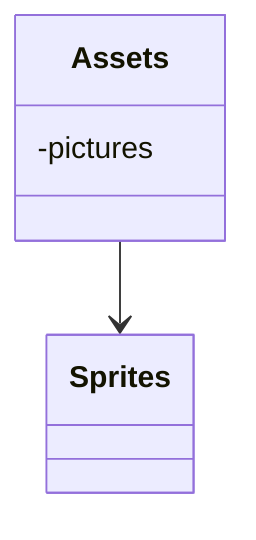
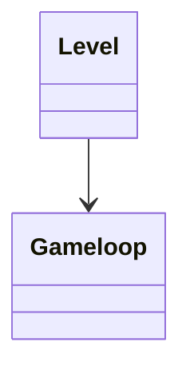
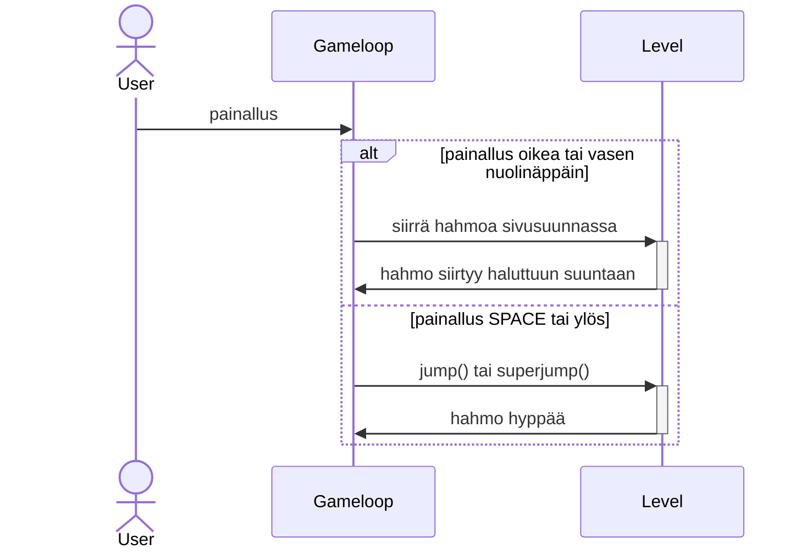

# Arkkitehtuurikuvaus

## Rakenne

Ohjelman pakkausrakenne on seuraava:

## Sovelluslogiikka

Ohjelman sovelluslogiikan muodostavat luokat Level ja Gameloop. Level vastaa tason luomisesta ja sen sisällöstä. Gameloop ohjaa tason tapahtumia ja pelitiloja.

## Päätoiminnallisuudet

### Liikkuminen

Liikkuminen toimii seuraavan kuvan mukaisesti. Oletetaan, että peli on jo käynnissä ja pelaajan ntiellä ei ole estettä.

